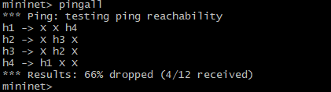
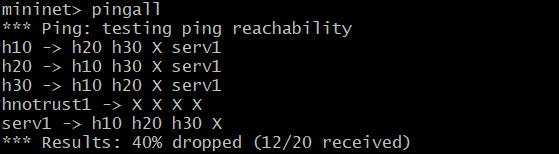
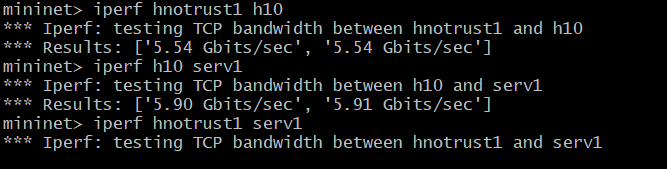

# Firewall Implementation based on SDN
   

## Description
**Firewall** Implementation based on Software Defined Networking **(SDN)** using **OpenFlow** controller, In this implementation, I am using  **[POX](https://github.com/noxrepo/pox)** as OpenFlow controller that developed in Python.
## Getting Started
### Dependencies
Dependencies are listed in `requirements.txt` file. \
but i am using `mininet Version2.3.0` which is accessible from [here](https://github.com/mininet/mininet/releases/download/2.3.0/mininet-2.3.0-210211-ubuntu-20.04.1-legacy-server-amd64-ovf.zip).
### Part2 Result
for part2 result of executing commands are shown below:
1. `pingall` command. that host No.1 and host No.4 can ping each other as well as host No.2 and host No.3 .

   

2. `iperf` command. command will hang cause we blocked IP traffic.

   

3. `dpctl dump-flows` command. for showing switche flow table rules.

   
### Part3 Result
for part3 result of executing commands are shown below:
1. `pingall` command. that untrusted host can not ping non of hosts.

   

2. `iperf` command. that untrusted host can not send traffic to server and command will hang.

   

3. `dpctl dump-flows` command. for showing switches flow table rules.

   

### Authors
Amir Rezaei [@ameerezae](https://github.com/ameerezae)
